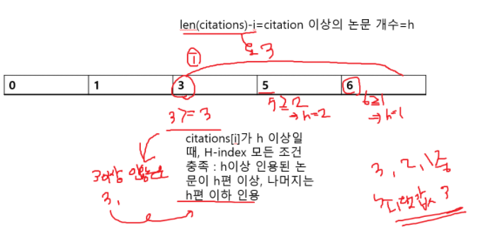

# 프로그래머스
- [H-Index](https://programmers.co.kr/learn/courses/30/lessons/42747)

### 문제 이해하기
- 논문 n편 중 h편 이상 인용된 논문이 h편 이상이고 나머지 논문은 h편 이하일 때, h최댓값이 H-Index
- 한 과학자가 발표한 논문의 인용 횟수를 담은 배열 citations이 주어짐
- 이 때 이 과학자의 H-Index를 리턴하는 문제
      

H-Index 예
- citations[3,0,6,1,5] 에서 발표한 논문 수(n)=5.
- 이 중 3편 논문 3회 이상 인용되고, 나머지 2편 3회 이하 인용됨.
- 따라서 H-Index = 3
### 문제 접근 방법

- 먼저 논문 인용수를 오름차순 정렬한다.
- 제일 처음 index부터 h-index에 부합하는지 검사한다
  - i번째 논문보다 인용이 많이 된 논문의 개수는 전체 논문 수에서 현재의 인덱스 값을 뺀 수인`len(citations)-i`이다.
  - 위 수가 만약 i번째 논문의 인용 수 이상이면 h-index에 부합한다.
  - 부합하는 수 중 최댓값을 리턴한다(정렬되어 있으니까 제일 h-index 조건에 부합하는 수가 최댓값이다)

### 구현 배경 지식


### 접근 방법을 적용한 코드
```
def solution(citations):
    answer = 0
    citations.sort()  # 정렬
    for i in range(0, len(citations)):
        if(citations[i] >= len(citations) - i):  # i번째 citation 이상의 논문 개수와 지금 논문의 인용 수 비교
            return len(citations) - i

    return answer

```
