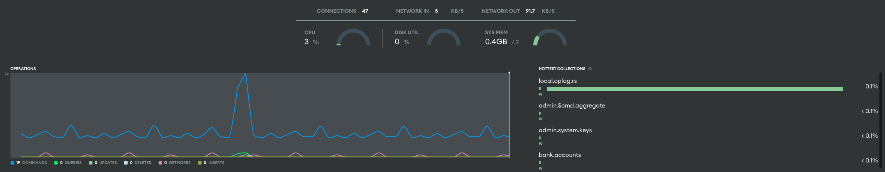

# Section05
## Unit 12. MongoDB Database Metrics & Monitoring
### Lesson1 : Core Metrics
모니터링을 할 때 설정할 값
* What we should monitor
* Baseline value
* Brust value
* Out of range

핵심 매트릭스
* Query targeting
  * 읽기 조작에서 리턴된 문서에 대한 스캔된 문서의 비율을 분석해서 읽기 효율 측정
  * 이상적인 값은 1
  * 높은 비율은 시스템 성능에 안좋은 영향을 미침
  * 쿼리와 인덱스에 대한 지표를 나타냄
  * y축은 비율, x축은 시간흐름
  * 파란색은 인덱스키비율, 초록색은 도큐먼트 읽기 비율
* Storage
  * 콜렉션 데이터베이스가 사용하는 디스크 비율
  * 스토리지 용량/성능에 대한 지표
    * Disk Space Percent Free
    * Disk IOPS
    * Disk Queue Depth
    * Disk Latency
* CPU Utilzation
  * CPU 사용을 추적하고, 시스템 및 프로세스 CPU 메트릭을 포함
  * 높은 CPU 사용은 조작 지연으로 이어질 수 있으며 열악한 쿼리 성능, 부적절한 하드웨어 사이징을 나타냄
* Memory Utilization
  * 메모리 지표는 워크로드에 사용 가능한 시스템 메모리 양에 대한 정보를 제공
  * 모든 인덱스를 보유할 수 있느 충분한 메모리 크기를 보유
  * OOM 이슈...
  * 메모리 성능에 대한 지표
    * Systme Memory
    * Swap Usage
* Replication lag
  * pramary - secondary간 지연을 나타냄
  * 초를 나타냄.
  * 분산 읽기 일관성에 대한 부정적 영향을 추정할 수 있음


> Which of the following is the ideal value for objects scanned when reviewing the Query Targeting metrics? (Select one.)

* a. 1

> You need to check if the storage subsystem has become a bottleneck. Which of the following storage metrics will help you determine if operations are waiting to be serviced? (Select one.)
> 저장소 병목현상이 일어났을 때 어떤 지표를 봐야 하냐

* b. Disk Queue Depth

### Lesson 2: More Metrics
쿼리 성능과 관련된 지표
* Opcounters
  * 몽고DB 프로세스에서 실행되는 초당 operation 수
  * operations : command, query, insert, delete, update, getMore
  * y축 : 초당 operation 수 평균
* Network traffic
  * 네트워크 성능에 대한 정보 제공하고 바이트수, 바이트아웃 및 번호 요청을 포함
* Connections
  * 애플리케이션, 쉘 클라이언트 및 내부 몽고DB 커넥션에 의해 데이터베이스에 대한 열린 netowrk connection 총 수
  * y축은 connection 수, x축 시간
* Tickets available
  * MongoDB 스토리지 엔진에 사용가능한 동시 읽기/쓰기 조작 수를 표시
  * 사용 가능한 티켓 수가 0이면 다른 조적은 실행중인 조작 중 하나가 완료될 때 까지 대기하고 티켓 해제 해야 함
  * 읽기 쓰기 기본 티켓 한계는 128개


> Which of the following metrics allows you to view the rate at which different types of operations are being performed within your deployment? (Select one.)

* d. Opcounters

> Which of the following metrics should you watch if you wish to monitor network traffic for your deployment? (Select all that apply.)

* a. bytesIn
* b. bytesOut
* c. numRequests

### Lesson 3: Monitoring M10+
아틀라스 CLI를 이용해서 모니터링 하는 방법 -> 얘가 몽고에 돈칠하게 되는 만악의 근원
* metrics 탭에서 확인 가능
  * Free
    * Connections / Network/ Opcounts / Locial Size
  * M10 + 
    * 그 외 40개 이상의 매트릭스


```
atlas processes list

atlas metrics processes <cluster id>  
--period P1D --granularity PT5M --output json –type connections
```


> Given the following Real-Time Performance Panel metrics displayed, how many connections are currently active? (Select one.)
>
> 

* d. 47

> MongoDB Atlas supports more than 40 metrics for M10+ clusters only.

* a. True

### Lesson 4: Configure Alerts
알랏 세팅하는 방법
* Alert 탭에서 레벨/권한/종류/알랏 설정할 프로젝트 등을 설정

view
```
atlas alerts settings list --output json
```

create
```
 atlas alerts settings create --event JOINED_GROUP --enabled \
 --notificationIntervalMin 5 \
 --notificationType USER \
 --notificationEmailEnabled \
 --notificationUsername < username> \
 --output json --projectId <project id> 
```

update
```
 atlas alerts settings update <alert id> \
 --event JOINED_GROUP \
 --enabled \
 --notificationIntervalMin 5 \
 --notificationType USER \
 --notificationEmailEnabled \
 --notificationUsername <username> \
 --output json \
 --projectId <project id> 
```

delete
```
atlas alerts settings delete <alertConfigId> 
```

> You are creating new alerts for an M5 (shared-tier) cluster and you successfully configure an alert for a Query Targeting metric. However, you notice that the alert isn’t being triggered, even though several queries are exceeding the threshold you set. Which of the following explains why the new alert isn’t being triggered? (Select one.)

* b. The Query Target alert condition will not trigger an alert for an M5 cluster.

> You have been granted the clusterAdmin role, will you be able to configure new alert conditions for a specific host? (Select one.)

* b. No, the Project Owner role is required to configure any new alerts for a specific host.

### Lesson 5: Respond to Alerts
아틀라스에서 알랏 확인하는 방법
* 알랏 수신할 때 까지 레드닷 나타남 -> 우측 상단에 알랏 확인해야 함

```
atlas alerts list --output json

atlas alerts acknowledge <alertId> --comment <comment>

atlas alerts unacknowledge <alertId>
```

> You receive a notification from Atlas that an alert has been triggered for your project and you wish to acknowledge the alert with the Atlas CLI. What information is required to successfully acknowledge the alert with the atlas alerts acknowledge command? (Select one.)

* d. id

> Under which of the following circumstances will an Atlas alert’s status change to CLOSED? (Select one.)

* c. When the alert condition is resolved

### Lesson 6: Integrations
아틀라스 통합 -> 경보 수집하고... 데이터독, 프로매테우스, 그라파나 . 모니터링 툴과 아틀라스를 통합하는 방법
* Organization Owner / Project Owner 권한이 필요

> MongoDB Atlas supports hybrid monitoring solutions via 3rd party integrations.

* a. True

> MongoDB Atlas provides 3rd party integration services with the following data. (Select all that apply.)

* b. Alerts
* d. Performance metrics that Atlas collects about your cluster

오답
* a. Index suggestions
* c. Query results

### Lesson 7: Self-Managed Monitoring
Cloud Manager를 제공하긴 하지만 권장하지  -> 아틀라스 써라ㅋ
* Percona : 오픈소스 몽고디비 모니터링 툴

> Prometheus gathers metrics from MongoDB Atlas via 3rd party integration but can also be used to collect metrics from a self-managed deployment using the following: (Select one.)

* d. Percona MongoDB Exporter

> Which of the following best describes how we can use the third-party tool, Grafana, to monitor a self-managed MongoDB deployment? (Select one.)

* c. We can use Grafana to ingest database metrics from a data source, like Prometheus, and display it on customizable charts for easy analysis.

### Lesson 8: Command Line Metrices
mongosh 를 이용해서 모니터링 하는 방법

```
// server Stats
db.runCommand(
   {
     serverStatus: 1
   }
)

// current Op
db.adminCommand(
   {
     currentOp: true,
     "$all": true
   }
)

// kill Op
db.adminCommand(
   {
     killOp: 1,
     op: <opid>,
     comment: <any>
   }
)
```

> MongoDB Atlas gathers active operation metrics from the database instance using which of the following commands? (Select one.)

* a. currentOp

> You wish to view the total number of active connections to your deployment while in the MongoDB Shell. Which of the following commands should you use? (Select one.)

* c. serverStatus

### Unit 12 정리
Lesson 1: Core Metrics
- [How to Monitor MongoDB](https://www.mongodb.com/basics/how-to-monitor-mongodb-and-what-metrics-to-monitor)
- [Review Available Metrics](https://www.mongodb.com/docs/atlas/review-available-metrics/#std-label-review-available-metrics)

Lesson 2: More Metrics
- [How to Monitor MongoDB](https://www.mongodb.com/basics/how-to-monitor-mongodb-and-what-metrics-to-monitor)
- [Review Available Metrics](https://www.mongodb.com/docs/atlas/review-available-metrics/#std-label-review-available-metrics)

Lesson 3: Monitoring M10+
- [Monitor Your Database Deployments](https://www.mongodb.com/docs/atlas/monitoring-alerts/)
- [Monitor Real-Time Performance](https://www.mongodb.com/docs/atlas/real-time-performance-panel/)
- [Replication Metrics Tab](https://www.mongodb.com/docs/atlas/review-replica-set-metrics/)
- [Atlas CLI: atlas metrics processes](https://www.mongodb.com/docs/atlas/cli/stable/command/atlas-metrics-processes/)

Lesson 4: Configure Alerts
- [Configure Atlas Alert Settings](https://www.mongodb.com/docs/atlas/configure-alerts/)
- [Review Alert Conditions](https://www.mongodb.com/docs/atlas/reference/alert-conditions/)
- [Atlas CLI: atlas alerts settings list](https://www.mongodb.com/docs/atlas/cli/stable/command/atlas-alerts-settings-list/)
- [Atlas CLI: atlas alerts settings create](https://www.mongodb.com/docs/atlas/cli/stable/command/atlas-alerts-settings-create/)
- [Atlas CLI: atlas alerts settings update](https://www.mongodb.com/docs/atlas/cli/stable/command/atlas-alerts-settings-update/)
- [Atlas CLI: atlas alerts settings delete](https://www.mongodb.com/docs/atlas/cli/stable/command/atlas-alerts-settings-delete/)

Lesson 5: Respond to Alerts
- [Resolve Alerts](https://www.mongodb.com/docs/atlas/alert-resolutions/)
- [Atlas CLI: atlas alerts list](https://www.mongodb.com/docs/atlas/cli/stable/command/atlas-alerts-list/)
- [Atlas CLI: atlas alerts acknowledge](https://www.mongodb.com/docs/atlas/cli/stable/command/atlas-alerts-acknowledge/)
- [Atlas CLI: atlas alerts unacknowledge](https://www.mongodb.com/docs/atlas/cli/stable/command/atlas-alerts-unacknowledge/)

Lesson 6: Integrations
- [Atlas Integrations](https://www.mongodb.com/docs/atlas/tutorial/third-party-service-integrations/)
- [Integrate with Prometheus](https://www.mongodb.com/docs/atlas/tutorial/prometheus-integration/)

Lesson 7: Self-Managed Monitoring

- [Cloud Manager](https://www.mongodb.com/docs/cloud-manager/application/)

Lesson 8: Command Line Metrics
- [serverStatus](https://www.mongodb.com/docs/manual/reference/command/serverStatus/)
- [currentOp](https://www.mongodb.com/docs/manual/reference/command/currentOp/)
- [killOp](https://www.mongodb.com/docs/manual/reference/command/killOp/)


## Unit 13. Self-Managed Backup & Recover
### Lesson 1: Backup plans on a MongoDB Server
백업플랜
* 데이터 백업 방법
* 데이터 백업 빈도
* 보존 기간
* 저장 위치

Regulatory obligations(규제 의무)
* 특정 시간 등에 데이터를 백업해야 할 수도 있다

백업계획 작성 시 알아야 할 용어
* Recovery Point Objective(RPO, 복구지점목표)
  * 시간당양으로 표현되는 중단이 발생하는 경우 비즈니스에서 허용할 수 있는 데이터 손실량
  * 데이터 중요도, 중단 시간 비용 등을 표현
  * 
* Recovery Time Objective(RTO, 복구시간목표)
  * 가동 중단 후 비즈니스가 허용할 수 있는 최대 시간
  * 시스템 중요도, 복구 프로세스, 자원 가용성 및 중단시간을 포함하는 요소로 판별
  * 3시간의 RTO가 있다 = 가동 중단 후 3시간 후 실행되어야 한다
* 복구 시점에 대한 목표.
  * ex) 1시에 백업 -> 6시에 장애 -> 9시에 복구 완료 = RPO는 4시간 / RTO는 3시간

> A business has determined it can tolerate the database being down for no more than one hour. What is this value called? (Select one.)

* a. Recovery Time Objective

> A business has determined that it can tolerate losing four hours of data. What is this value called? (Select one.)

* b. Recovery Point Objective

> Which of the following are key elements of a backup plan? (Select all that apply.)

* a. How to back up the data
* c. How often the data needs to be backed up
* d. How long to retain the backup data

### Lesson 2: Filesystem snapshots on a MongoDB Server
스냅샷은 특정 시점의 전체 데이터에 대한 사본
* snapshot volume : point in time / read only view
* volumn : 데이터를 저장하고 액세스 할 수 있는 파일시스템이 있는 컨테이너

> Before you create a snapshot, you need to lock your MongoDB deployment. (True or false.)

* a. True
  *  db.fsyncLock() 으로 락 걸고 해야함

> You want to create a complete copy of your data at a specific point in time. How can you accomplish this? (Select one.)

* c. Create a snapshot of your data

### Lesson 3: Filesystem snapshot on volums on a MongoDB Server
physical volumn
* vg0 : 600MB 의 logical volun(mdb라고 불리는..)
  * /var/lib/mongodb 에 위치해있다

### Lesson 4: Filesystem archives on a MongoDB Server

### Lesson 5: Backing up a MongoDB Deployment

### Lesson 6: Restoring a MongoDB Deployment

### Unit 13 정리

## Unit 14. Self-Managed Upgrades & Maintenance
### Lesson 1: Zero Downtime Maintenance wit a MongoDB Deployment
유지보수를 할 때에도 고가용성을 잃지 않을 수 있다


### Lesson 2: MongoDB Client Driver upgrades

### Lesson 3: MongoDB Server Upgrades

### Unit 14 정리
