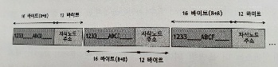
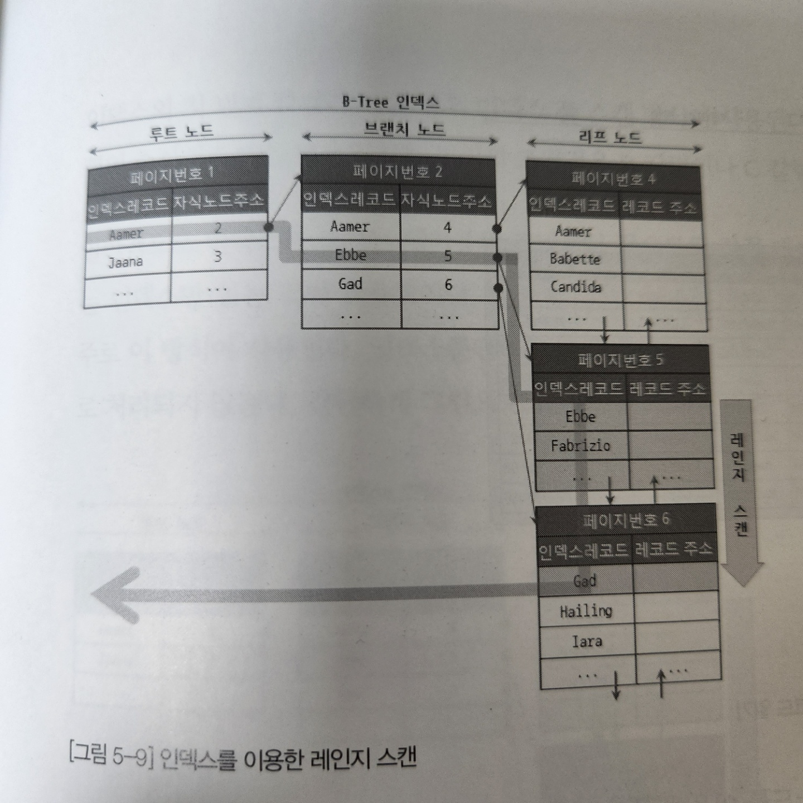
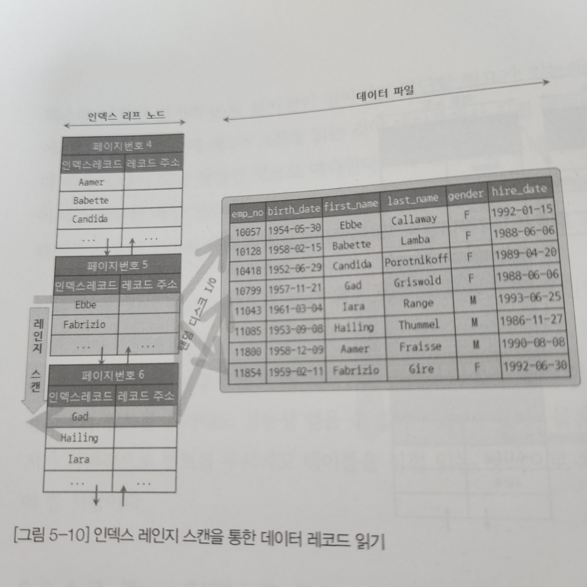
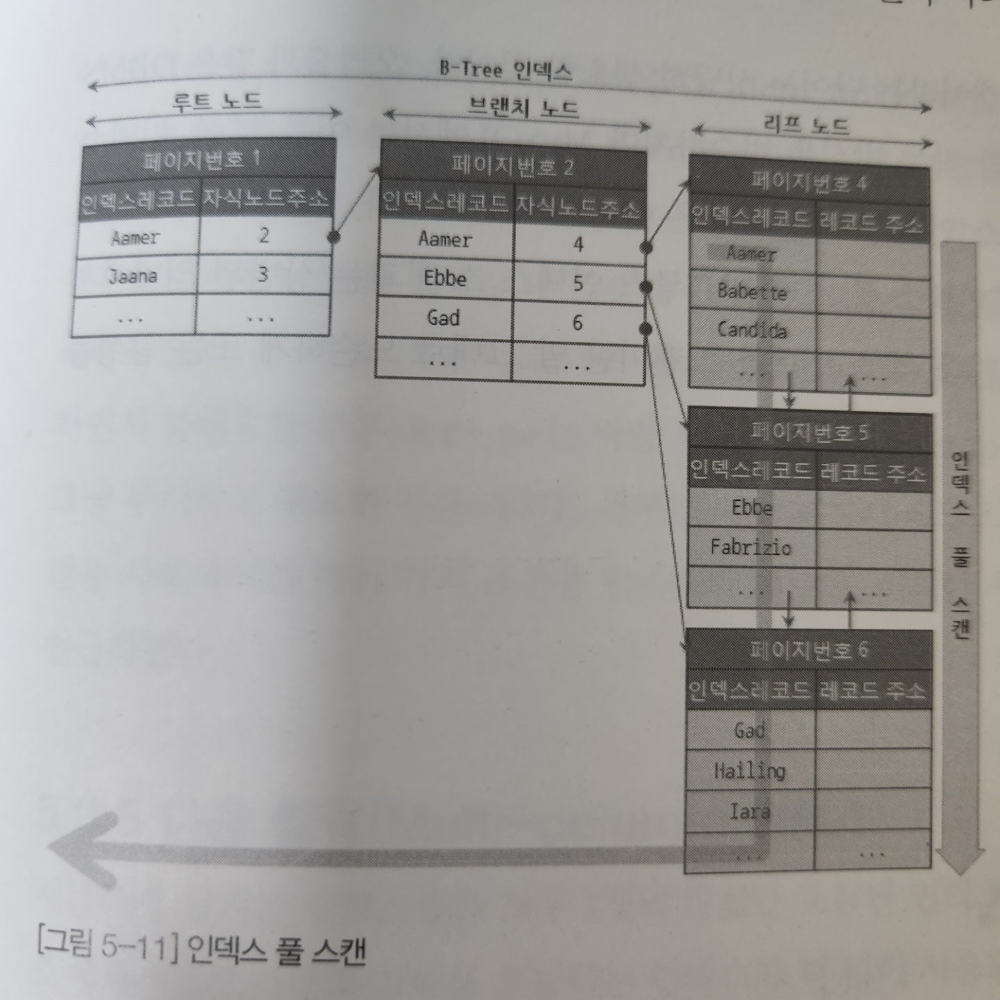
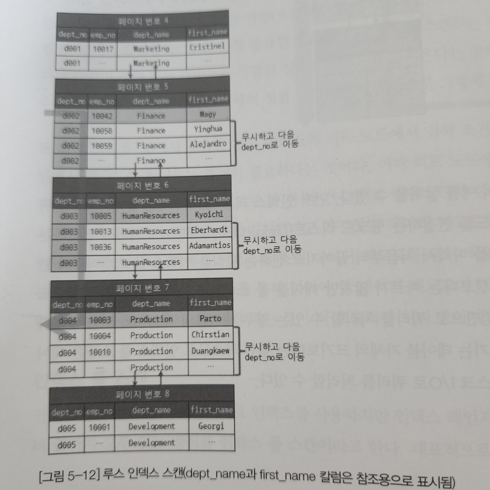
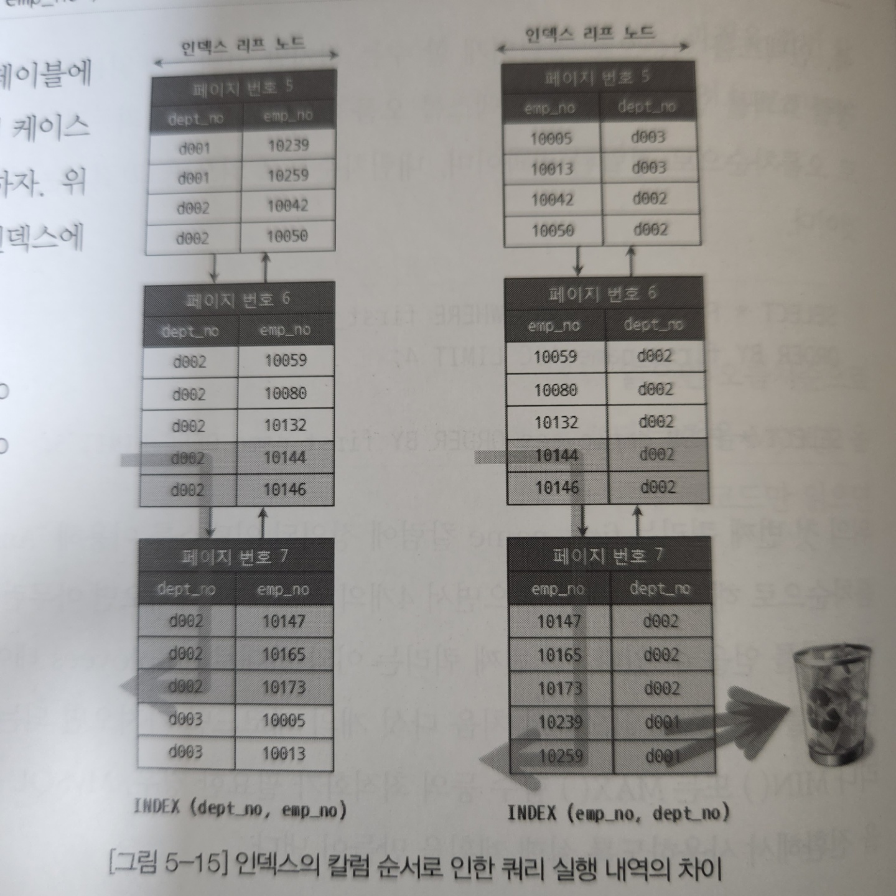
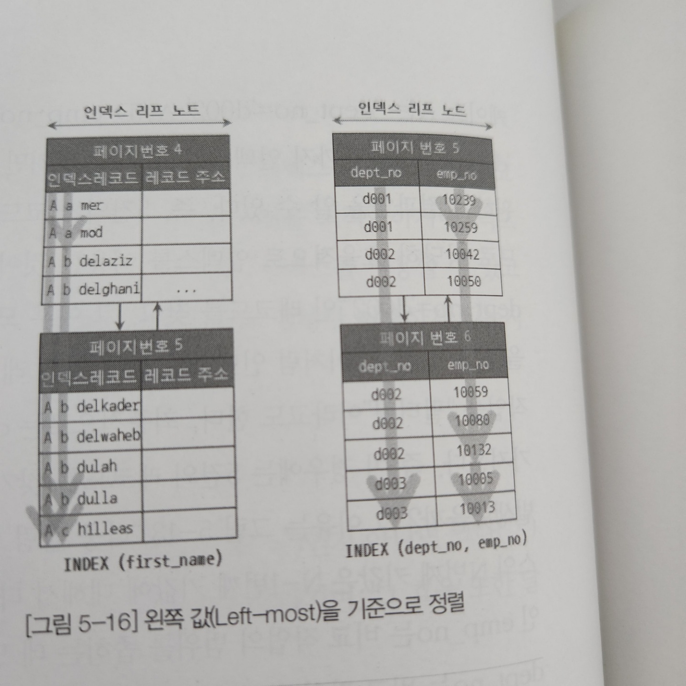
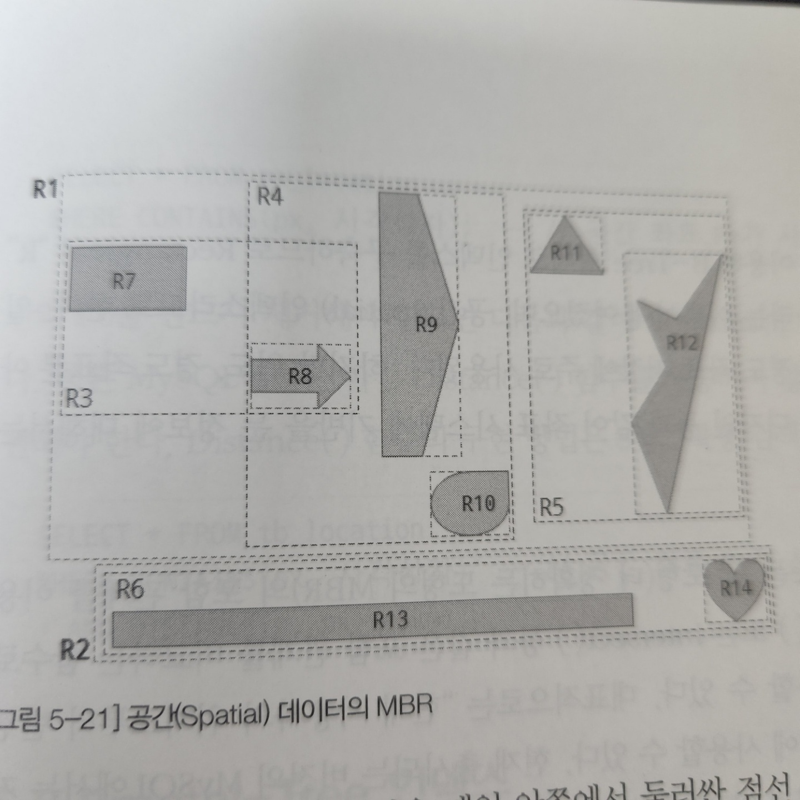
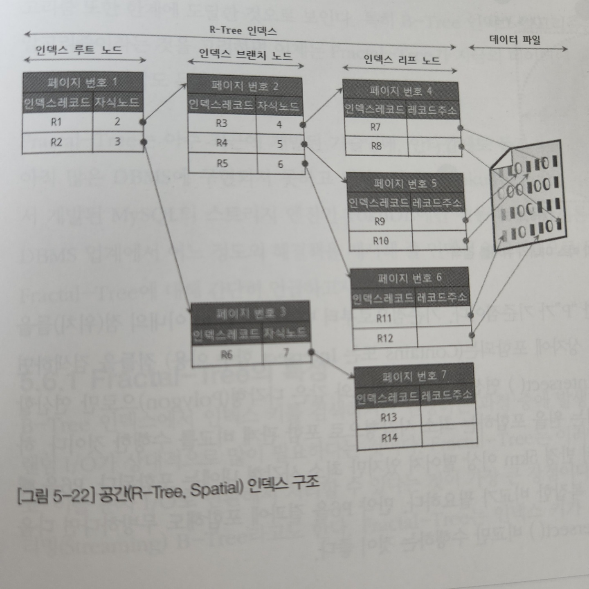

# Real MySQL - ch05 인덱스
- MySQL에서 사용 가능한 인덱스 종류 및 특성

## 5.1 디스크 읽기 방식
DB 성능 튜닝 중, 어떻게 디스크 I/O를 줄이느냐가 관건인 것들이 상당히 많음
### 5.1.1 저장매체
데이터를 저장할수 있는 메체(Disk)
- 내장 디스크(Internal Disk)
  - PC 본체 내에 장착된 디스크
  - DB 서버용 장비는 일반적으로 4~6개 내장 디스크를 장착함. -> 컴퓨터 본체 내부 물리적 공간이 제한적이라 장착할 수 있는 디스크개수도 적고, 용량도 부족
- DAS(Direct Attached Storage)
  - 내장디스크 용량 문제 해결
  - 디스크만 존재. 독자적으로 사용 불가. 컴퓨터 본체에 연결해서 사용
  - 사용 방식, 성능은 내장디스크와 거의 동일.
  - 대용량 디스크에 적합.
  - 반드시 하나의 컴퓨터 본체에만 연결해야 하기 때문에 해당 디스크 정보 여러 컴퓨터가 동시에 공유 불가
- NAS(Network Attached Storage)
  - 네트워크(TCP/IP)를 통해 연결
    - 빈던한 데이터 읽고 쓰기가 필요한 DB 서버용으로는 사용되지 않음
  - 여러 컴퓨터에서 공유해서 사용 가능
  - SATA, SAS 보다는 느림
- SAN(Storage Area Network)
  - DAS로 구축불가한 아주 대용량 스토리지 공간 제공
  - 여러 컴퓨터에서 동시에 읽는 것 가능, 컴퓨터 본체와 광케이블로 연결되어 빠르고 안정적인 데이터처리 -> 비쌈

#### 사양
(저사양) 내장디스크 < DAS < SAN (고사양)

전부 플래터(Platter, 디스크 드라이브 내부의 데이터 저장용 원판) 사용함

## 5.1.2 디스크 드라이브와 솔리드 스테이트 드라이브(SSD, Solid State Drive)
기계식 장치가 플래터를 회전시켜 데이터를 저장 -> 디스크 장치가 병목지점이 됨
- 기계식 드라이브 대체 => SSD(Solid State Drive)
  - 인터페이스(SATA, SAS)를 지원함 -> 내장디스크, DAS, SAM에 그대로 사용 가능

플래터 대신 **플래시 메모리** 장착함.
- 원판 기계식 회전 필요 x
- 매우 빠름
- 전원 공급되지 않아도 데이터 삭제되지 않음.
- D-RAM(컴퓨터 메모리)보다는 느리지만 기계식 디스크 드라이브보다 훨씬 빠름
- 초당 트랜잭션 처리 수
  - SSD : 436
  - HDD : 60

일반적인 웹서비스(OLTP)에서는 SSD가 HDD보다 훨씬 빠르다.

## 5.1.3 랜덤 I/O와 순차 I/O
랜덤, 순차 모두 디스크 드라이브의 플래터(원판)를 돌려서 읽어야 할 데이터가 저장된 위치로 디스크 헤더를 이동시킨 뒤 데이터를 읽는 방식.

- 순차 I/O
  - 3개 페이지 디스크 기록 위해 1번의 시스템 콜 요청
- 랜덤 I/O
  - 3개 페이지 디스크 기록 위해 3번 시스템 콜 요청

순차I/O가 랜덤보다 훨씬 빠르고, 부하가 적음.

DB 대부분이 작은 데이터를 빈번히 읽고 씀 -> MySLQ 서버에 그룹 커밋, 바이너리 로그 버퍼, InnoDB 로그 버퍼 기능 내장(부하 막기 위해)

쿼리 튜닝으로 랜덤 I/O를 순차 I/O로 바꿔 실행 할 방법이 많지 않음..
- 일반적으로 쿼리 튜닝 하는게 랜덤 I/O 자체를 줄여주는 것이 목적
- 랜덤 I/O를 줄이는 것 : 쿼리를 처리하는데 꼭 필요한 데이터만 읽도록 쿼리 개선하는 것
  - 레인지 스캔은 데이터 읽기 위해 랜덤 I/O 사용
  - 풀테이블 스캔은 순차 I/O 사용
  - => 큰 테이블 레코드 대부분을 읽는 작업에서는 인덱스 사용 않고 풀테이블 스캔 유도...(순차가 랜덤보다 훨씬 많이 읽어올 수 있기 때문) -> OLTP 성격의 웹서비스 보다는 DW, 통계 작업에서 자주 사용됨


## 5.2 인덱스란?
- 컬럼 값을 주어진 순서로 미리 보관하는 것(Key-Value Pair로 인덱스 미리 생성)

인덱스를 자료구조로 표현
- Sorted List
  - 정렬되어있기 때문에 아주 빠르게 원하는 값을 찾을 수 있음
  - 저장할 때 마다 정렬해야 하기 때문에 저장 과정이 복잡하고 느림
- Array List
  - 저장하는 그대로 값을 저장.

인덱스 결론
- 데이터 저장(INSERT, UPDATE, DELETE) 성능 희생하고 데이터 읽기 속도 향상

인덱스 역할별 분류
- PK
  - 레코드 대표하는 컬럼 값
  - 식별자
  - NULL, 중복 허용 X
- 보조키(Second Key)
  - PK 제외한 나머지 인덱스는 모두 보조 인덱스(Secondary Index)로 분류.
  - 유니크 인덱스 : PK와 성격비슷, PK 대체 가능 -> 대체키라고도 불림(별도로 분리하기도 하고 보조키와 묶이기도 하고..)

데이터 저장방식(알고리즘)별 분류
- B-Tree 인덱스
  - 일반적으로 사용하는 인덱스 알고리즘
  - 컬럼 값 변형 x, 원래의 값을 이용해 인덱싱
- Hash 인덱스
  - 컬럼 값으로 해시 값 계산
  - 매우 빠른 검색 지원
  - 값을 변형해서 인덱싱 -> 전방(Prefix) 일치와 같이 값의 일부만 검색하고자 할 때 해시 인덱스 불가
  - 메모리 기반 DB에서 사용
- Fractal_Tree
  - B-Tree 단점 보완
  - 값을 변형하지 않고 인덱싱, 범용적인 목적으로 사용 가능(B-Tree와 유사)
  - 데이터가 저장, 삭제 될때 B-Tree에 비해 처리 비용 줄일 수 있도록 설계됨
  - 아직 B-Tree만큼 안정적이진 않음

데이터 중복 여부 분류
- Unique 인덱스
- Non-Unique 인덱스


## 5.3 B-Tree 인덱스
인덱싱 알고리즘 중 가장 일반적으로 사용되고, 가장 먼저 도입된 알고리즘.

원래의 값을 변형시키지 않고 인덱스 구조체 내에서 항상 정렬된 상태 유지

여러 변형된 알고리즘 있음(B*-Tree, B+-Tree)

### 5.3.1 구조 및 특성
최상위에 하나의 루트노드 존재, 그 하위에 자식노드 붙어있음. 가장 하위 노드를 "리프 노드" 라 부름.
- DB에서 인덱스와 실제 저장된 데이터는 따로 관리됨
- 리프노드 : 항상 실제 데이터 레코드 찾아가기 위한 주소 값 갖고 있음

INSERT 시 레코드 순서대로 인서트 되는 것이 아닌, 레코드 삭제되어 빈 공간이 생겼을 시, Index가 빈 공간 재활용 할 수 있도록 DBMS 설계되어 있다.

*InnoDB 테이블에서는 PK에 의해 클러스터링 되기 때문에 PK 자체가 주소 역할을 함
### 5.3.2 B-Tree 인덱스 키 추가 및 삭제
테이블 레코드 저장, 변경 시 인덱스 키 추가 및 삭제 작업이 발생.

#### 인덱스 키 추가
- B-Tree에 저장 시 저장될 키 값을 이용해 B-Tree 상 적절한 우치를 검색해야 함.
- 저장될 위치가 결정되면 레코드 키값과 대상 레코드 주소정보를 B-Tree 리프노드에 저장
- 리프노드가 꽉 차면 리프노드가 분리됨 -> 상위 브랜치 노드까지 처리 범위가 더 넓어짐 => B-Tree 쓰기 작업 비용 많이 든다

대략적인 B-Tree 인덱스 INSERT, UPDATE 작업 비용 : 테이블에 레코드 추가하는 비용을 1이라 했을 때, 해당 테이블 인덱스에 키를 추가하는 작업 비용을 1~1.5로 예측
- 테이블에 B-Tree 인덱스 3개 : 5.5 비용(1.5*3+1)
- 비용 대부분은 메모리 CPU 처리가 아닌 디스크로부터 인덱스 페이지를 읽고 쓰는 비용

Insert 시 키값 반영
- MyISAM or Memory : 즉시 새로운 키값을 B-Tree 인덱스에 반영. 키 추가하는 작업 완료 까지 클라이언트는 쿼리 결과 받지 못하고 기다림. "delay-key-write" 파라미터 설정해서 인덱스 키 추가 작업 지연 가능 -> 동시 작업 환경에서 적합하지 않음
- InnoDB : 좀 더 지능적으로 처리. 인덱스 키 추가 작업을 지연시킬지 바로 처리할지 결정함.


1. 사용자 쿼리 실행
2. InnoDB 버퍼 풀에 새로운 키 값 추가할 페이지(B-Tree 리프노드) 존재하면 즉시 키 추가 처리
3. 버퍼풀에 B-Tree 리프노드 없으면 인서트 버퍼에 추가할 키 값과 레코드 주소를 임시로 기록해두고 작업 완료(사용자 쿼리 실행 완료됨)
4. 백그라운드 작업은 인덱스 페이지 읽을 때 마다 인서트 버퍼에 머지해야 할 인덱스 키 값 확인 후 병합(B-Tree에 인덱스 키와 주소 저장)
5. DB 서버 자원 여유 생기면 MySQL 서버 인서트 버퍼 머지 스레드가 조금씩 인서트 버퍼에 임시 저장된 인덱스 키와 주소 값을 머지(B-Tree 인덱스 키와 주소 저장)시킴

=> MySQL 5.1 이하는 이 기능을 인서트 버퍼링이라 함(인서트로 인한 인덱스 키 추가 작업만 버퍼링 및 지연 처리 가능했음)

=> MySQL 5.5 이상 부터는 **체인지 버퍼링** 이라 함.
- 관련 설정 파라미터 : `innodb_change_buffering`
- 위 키 추가/삭제 중 어떤 것 지연처리할지 설정
- 버퍼에 의해 인덱스 키 추가 작업 지연되어도 사용자에게는 영향 없기 때문에 개발자는 신경쓰지 않아도 됨


#### 인덱스 키 삭제
B-Tree 리프노드 찾아서 삭제 마크만 하면 작업 끝.   
삭제 마킹된 인덱스 키 공간은 계속 그대로 방치되거나 재활용 가능함.   
인덱스 키 삭제로 인한 마킹 작업도 디스크 쓰기가 필요하여 Disk I/O 필요한 작엄.   
MySQL 5.5 이상은 버퍼링되어 지연 될 수 있음.    

#### 인덱스 키 변경
키값 삭제한 뒤, 새로운 키값을 추가하는 형태.

#### 인덱스 키 겁색
INSERT, UPDATE, DELETE 작업의 추가비용을 감당하여 인덱스를 구축하는 이유 -> 빠른 검색

B-Tree 루트노드부터 브랜치노드를 거쳐 리프노드까지 이동하며 비교작업 수행 **"트리 탐색(Tree traversal)"**   
- SELECT 뿐만 아니라 UPDATE, DELETE 처리 위해 해당 레코드 먼저 검색해야 할 경우에도 인덱스 있으면 빠른 검색 가능.
- B-Tree 이용한 검색은 100% 일치 또는 값의 앞부분(left-most-part)만 일치하는 경우에 사용 가능 (부등호(< or >)나 값의 뒷부분이 일치하는 경우는 사용 불가능)
- 인덱스 변셩 가해진 후 B-Tree 빠른 검색 사용 불가능

InnoDB에서의 인덱스
- 테이블에서 지원하는 레코드 잠금이나 넥스트 키 락(갭 락)이 검색 수행한 인덱스를 잠근 후 테이블의 레코드를 잠그는 방식으로 구현됨
- UPDATE, DELETE 실행 시 테이블에 적절히 사용할 수 있는 레코드가 없으면 불필요하게 많은 레코드를 잠금 => 인덱스 설계가 중요하고 많은 부분에 영향.


### 5.3.3 B-Tree 인덱스 사용에 영향을 미치는 요소
B-Tree 인덱스는 인덱스 구성하는 컬럼 크기와 레코드 건수, 유니크한 인덱스 키값 개수 등에 의해 검색이나 변경 작업 성능 영향

#### 인덱스 키 값의 크기
- 페이지 or 블록 : InnoDBㅔ서 디스크에 데이터를 저장하는 가장 기본단위. 모든 읽기, 쓰기 작업의 최소 단위가 됨.
- 인덱스도 페이지 단위로 관리됨
- 루트와 브랜치, 리프노드를 구분하는 기준이 페이지 단위

일반적인 DBMS B-Tree는 자식노드 개수가 가변적.
- B-Tree 자식노드 개수는 **인덱스 페이지 크기** 와 **키 값의 크기**에 따라 결정됨
- InnoDB의 모든 페이지 크기는 16KB로 고정




#### B-Tree 깊이
- 중요하지만 직접 제어할 수 있는 방법이 없음.

B-Tree 깊이가 3인 경우 최대 가질 수 있는 키 값
- 키값 16바이트 : 최대 2억(585 * 585 * 585)개 키값 담을 수 있음
- 키값 32바이트 : 5천만(372 * 372 * 372)개

=> 키값이 커질수록 하나의 인덱스 페이지가 담을 수 있는 인덱스 개수가 줄어든다.

#### 선택도(기수성)
- 모든 인덱스 키값 가운데 유니크한 값의 개수.
- 중복된 값이 많을수록 기수성은 낮아지고, 선택도도 낮아짐
- 선택도가 높을수록 검색 대상이 줄어듦 -> 빠르게 처리됨

ex)
```SQL
CREATE TABLE tb (
  ...
  INDEX ix_country (country)
);

SELECT * FROM tb WHERE contry='korea' and city='seoul';
-- row 10000개
-- contry='korea' and city='seoul' 은 1건
```
- country 컬럼 유니크 값 10개 일 때
  - `country='korea'` 검색 시 일치 결과 : (10000/10) = 1000건
  - 이 중 `city='seoul'` 은 1건이기 때문에 999건을 불필요하게 읽게 됨
- country 컬럼 유니크 값 1000개 일 때
  - `country='korea'` 검색 시 일치 결과 : (10000/1000) = 10건
  - 이 중 `city='seoul'` 은 1건이기 때문에 9건을 불필요하게 읽게 됨
#### 읽어야 하는 레코드 건수
- 인덱스를 통해 테이블 레코드 읽는 것은 인덱스 거치지 않고 레코드 읽는 것 보다 높은 비용 발생
- **인덱스 통해 레코드 1건 읽는 것인 직접 레코드 1건 읽는 것 보다 4~5배 비용 많이 드는 것으로 예측함**
  - 읽어야 할 레코드 건수가 전체 테이블 레코드 20~25% 이상일 시 풀스캔 처리가 효율적
- 100만 건 중 50만 건 데이터 읽을 때 인덱스 거쳐서 필요한 50만 건만 읽는게 효율적인지, 풀스캔이 효율적인지 판단해야 함
  - 인덱스의 손익분기점(20~25%) 이상이기 때문에 풀스캔이 효율적

### 5.3.4 B-Tree 인덱스를 통한 데이터 읽기
#### 인덱스 레인지 스캔
- 아래 2가지 접근 방식보다 빠름
- 검색해야 할 인덱스 범위가 결정되었을 때 사용

```SQL
SELECT * FROM employees WHERE first_name BETWEEN 'Ebbe' AND 'Gad';
```


- 루트노드부터 비교를 시작해 브랜치를 거쳐 리프노드까지 찾아가서 시작 지점을 찾음
- 시작 지점부터 차례로 읽으며 종료 지점까지 읽음
- 두 번째 그림처럼 인덱스를 읽으며 레코드를 가져오는 과정도 필요.
  - 레코드 한 건 단위로 랜덤 I/O가 한 번씩 발생
  - => 인덱스를 통해 데이터를 읽는 작업은 비용이 많이 든다

#### 인덱스 풀 스캔

- 인덱스를 처음부터 끝까지 모두 읽는 방식
- 조건절에 사용된 컬럼이 인덱스의 첫 번째 컬럼이 아닌 경우 ( IDX(A,B,C) 인데 B컬럼이나 C컬럼 조건절인 경우)
- 인덱스만 읽는 경우는 풀스캔보다 효과적이지만, 레코드까지 읽어야 하는 경우 절대 인덱스 풀스캔으로 처리 x

#### 루스 인덱스 스캔

- Oracle : 인덱스 스킵 스캔
- 느슨하게 듬성듬성 인덱슬르 읽는 것
- 인덱스 레인지 스캔과 비슷하게 작동하지만, 중간에 필요하지 않은 인덱스 키 값은 무시(Skip)하고 다음으로 넘어감
- GROUP BY 또는 집합함수 가운데 MAX() or MIN()함수에 대해 최적화 하는 경우 발생

```SQL
INDEX(dept_no, emp_no)

SELECT dept_no, MIN(emp_no)
FROM dept_emp
WHERE dep_no, BETWEEN 'd001' AND 'd004'
GROUP BY dept_no;
```
- dept_no 그룹 별 가장 첫번째 emp_no 값만 읽으면 됨

### 5.3.5 다중 컬럼(Multi-column)인덱스

- 레코드 건수 적은 경우 브랜치 노드 없는 경우 존재(루트, 인덱스 노드 반드시 존재)
- 인덱스 두번째 컬럼은 첫번째 컬럼에 의존하여 정렬됨
  - 두번째 컬럼의 정렬은 첫번째 컬럼이 같은 레코드에서만 의미있음
- 따라서 인덱스 순서 설정 중요!


### 5.3.6 B-Tree 인덱스의 정렬 및 스캔 방향
인덱스 키값은 항상 오름차순 정렬 -> 인덱스를 거꾸로 읽으면 내림차순 정렬된 인덱스 활용 가능
#### 인덱스의 정렬
- 인덱스를 생성하는 시점에 각 컬럼 정렬을 오름차순 혹은 내림차순으로 설정 가능
- MySQL은 정렬 방식 혼합하여 사용 불가능
```SQL
CREATE INDEX ix_test ON emp (team ASC, user DESC);
```
- 위 경우 인덱스 생성은 되지만, 실제로는 ASC, DESC 무시하고 모든 컬럼이 오름차순으로 정렬됨
- ASC, DESC 혼합해서 사용하고 싶으면 컬럼 값을 역으로 변환해서 구현해야 함

```SQL
-- 7.4.8 Order By
-- 숫자 타입은 반대 부호로 변환하여 컬럼에 저장!
```

#### 인덱스 스캔 방향
- 인덱스는 항상 오름차순으로 정렬되어 있지만, 가까운 방향으로 데이터를 읽어옴
- 쿼리 Order by 처리나 MIN() MAX() 함수 등의 최적화 필요한 경우 MySQL 옵티마이저가 읽기 방향 전환하여 사용하도록 실행계획 만들어냄

### 5.3.7 B-Tree 인덱스의 가용성과 효율성
- 쿼리의 WHERE, GROUP BY, ORDER BY 절에서 인덱스 사용하는지 식별 가능해야 쿼리 최적화 가능
- 어떤 조건에서 인덱스 사용할 수 있는지
- 인덱스 100% 활용 가능한지
#### 비교조건의 종류와 효율성
- 다중 컬럼 인덱스에서 각 컬럼 순서와, 그 컬럼에 사용된 조건이 동등비교인지, 범위조건인지에 따라 각 인덱스 활용 형태 달라짐



```SQL
-- case 01
CREATE INDEX ix_test ON emp (dept_no, emp_no)
-- case 02
CREATE INDEX ix_test ON emp (dept_no, emp_no)


SELECT * FROM emp
WHERE dept_no='d001' AND emp_no >= 10114;
```
case01
- 처음 dept_no='d001' and emp_no>=10113 인 레코드 찾은 뒤, dept_no가 d001이 아닐 때 까지 인덱스 쭉 읽으면 됨
- 필요한 인덱스만 읽게 됨
- **작업 범위 결정조건**

case02
- 불필요한 작업 포함됨
- 오피려 쿼리 실행 더 느리게 만들 때가 많다
- **필터링 조건, 체크 조건**
#### 인덱스의 가용성

- B-Tree 인덱스 특징 : 왼쪽 값에 기준(Left-most)해서 오른쪽 값 정렬됨
  - 왼쪽이라 함은 하나의 컬럼 뿐만 아닌 다중 컬럼 인덱스에 대해서도 적용됨
  - 하나의 컬럼으로 검색해도 왼쪽 부분 없으면 인덱스 검색 불가능


B-Tree 인덱스 사용 불가능한 경우
```SQL
INDEX ix_1 ON emp (first_name);
INDEX ix_1 ON emp (dept_no, emp_no);


SELECT * FROM emp WHERE first_name LIKE '%mer';
SELECT * FROM emp WHERE emp_no >= 1000;
```
#### 가용성과 효율성 판단
B-Tree 인덱스 사용 불가능한 경우
- NOT-EQUAL로 비교된 경우(<>, NOT IN, NOT BETWEEN, IS NOT NULL)
- LIKE '%??' (앞 부분이 아닌 뒷 부분 일치) 형태로 LIKE 연산자 사용
- 스토어드 함수나 다른 연산자로 **인덱스 컬럼 변형된** 후 비교된 경우
- NOT-DETERMINISTIC 속성의 스토어드 함수가 비교 조건에 사용된 경우
- 데이터 타입이 서로 다른 비교(인덱스 컬럼 타입 변환해야 비교 가능한 경우)
- 문자열 테이터 타입 콜레이션 다른 경우

다중컬럼 인덱스에서 작업 범위 결정 조건으로 인덱스 사용하지 못하는 경우
- col_1 컬럼에 대한 조건 없는 경우
- col_1 컬럼 비교 조건이 위의 인덱스 사용 불가 조건 중 하나인 경우

다중컬럼 인덱스에서 작업 범위 결정 조건으로 인덱스 사용하는 경우
- col_1 ~ col(i-1) 컬럼까지 Equal 형태 비교
- col_i 컬럼에 대해 다음 연산자 중 하나로 비교
  - Equal(= 또는 IN)
  - 크다 작다
  - LIKE 좌측 일치


## 5.4 해시(Hash) 인덱스
- B-Tree 만큼 범용적이지는 않지만, 고유의 특성을 가진 인덱스.
- 동등 비교 검색에 최적화 되어있음
- 범위 검색, 정렬된 결과 가져오는 목적 x
- 메모리 기반 테이블에 구현. 디스크 기반의 대용량 테이블에는 구현 x
  - NoSQL 에 활용되는 것으로 이해?

### 5.4.1 구조 및 특성
- 실제 키 값과 는 관계 없이, 인덱스 크기가 작고 검색이 빠르다.
- 검색하고자 하는 값 입력하면, 해시 함수를 거쳐 찾고자하는 키값이 포함된 버킷을 찾아냄. -> 버킷 하나만 읽어 비교해 실제 레코드 저장된 위치 찾음
  - 해시함수 : 입력된 키 값이 어디에 저장될지를 결정하는 함수
- DBMS에서 해시 알고리즘은 검색을 위한 인덱스와 테이블 파티셔닝 용도로 사용됨.


충돌 : 입력 값은 다르지만, 해시 함수 결과가 같은 경우
```
해시함수 F(val) = CRC32(val)%10

F('Banette') = 7
F('Aamer') = 9
F('Janna') = 9
```

### 5.4.2 해시 인덱스의 가용성 및 효율성
- 빠른 검색 제공
- 키값 자체가 변환되어 저장되기 때문에 범위 검색, 원값 기준 정렬 불가
- B-Tree와 다르게 어떤 방식으로도 해시 인덱스 사용하지 못하는 경우 발생함

#### 작업 범위 제한 조건으로 해시 인덱스를 사용하는 쿼리
```SQL
SELECT * FROM tb_hash WHERE column='검색어';
SELECT * FROM tb_hash WHERE column<=>'검색어';
SELECT * FROM tb_hash WHERE column IN ('검색어', '검색어2');
SELECT * FROM tb_hash WHERE column IS NULL;
SELECT * FROM tb_hash WHERE column IS NOT NULL;
```
- 동등비교조건으로 값 검색하기 때문에 해시 인덱스 장점 그대로 이용 가능
  - IN 연산자도 여러 동등 연산자로 풀어 처리 가능하기 때문에 같은 효과

#### 해시 인덱스 사용 못하는 쿼리
```SQL
SELECT * FROM tb_hash WHERE column>='검색어';
SELECT * FROM tb_hash WHERE column BETWEEN 100 AND 200;
SELECT * FROM tb_hash WHERE column LIKE '검색어%';
SELECT * FROM tb_hash WHERE column <> '검색어';

CREATE TABLE tb_hash2 (
  ...
  INDEX ix_mem(member_id, session_id) using HASH
) ENGINE=MEMORY;
SELECT * FROM tb_hash2 WHERE member_id='nickname';
```
- 범위비교, 부정형 비교는 해시 인덱스 사용 불가
- 다중 컬럼 인덱스 에서는 모든 컬럼이 동등조건으로 비교되는 경우만 해시 인덱스 사용 가능
- MEMORY 스토리지 엔진에서는 인덱스 알고리즘 명시하지 않으면 기본적으로 해시 인덱스 적용됨


## 5.5 R-Tree 인덱스
- 기본적인 내부 매커니즘은 B-Tree와 유사
- B-Tree는 인덱스 구성하는 컬럼 값이 1차원 스칼라값이면, R-Tree는 2차원 공간 개념 값

MySQL 공간 확장
- 위치 기반 서비스 구현
- 기능
  - 공간을 저장할 수 있는 데이터 타입
  - 공간 데이터 검색을 위한 공간 인덱스(R-Tree 알고리즘)
  - 공간 데이터 연산 함수(거리 또는 포함 관계 처리)

### 5.5.1 구조 및 특성
MySQL에서 지원하는 기하학적 도형 데이터 타입
- POINT
- LINE
- POLYGON
- GEOMETRY
  - 위 3개 타입의 수퍼타입
  - POINT, LINE, POLYGON 모두 저장 가능

MBR(Minimum Bounding Rectangle)
- 해당 도형을 감싸는 최소 크기의 사각형

R-Tree 인덱스
- MBR 포함관계를 B-Tree 형태로 구현한 것



- MBR을 3게 레벨로 나눠 저장
  - 최 상위 : R1, R2
  - 차상위 : R3 ~ R6
  - 최 하위 : R7 ~ R14
- 최상위는 루트노드에, 차상위는 브랜치노드에, 각 도형 객체는 리프노드에 저장됨

### 5.5.2 R-Tree 인덱스 용도
- 각 도형(MBR)의 포함관계를 이용해 만들어진 인덱스
- containse(), Intersect() 와 같은 포함관계를 비교하는 함수로 검색을 수행하는 경우 인덱스 이용 가능
  - 현재 위치 사용자로부터 5km 내 음식점 검색 등...


## 5.6 Fractal-Tree 인덱스
- 최근 개발된 기술
- TokuTek에서 개발된 MySQL 스토리지 엔진인 TokuDB에만 적용됨
- 대용량 DBMS 해결책 제시해줄 인덱싱 알고리즘

### 5.6.1 Fractal-Tree 특성
B-Tree 단점
- 디스크 랜덤I/O가 상대적으로 많이 필요

=> Fractal-Tree는 이런 B-Tree 단점 최소화 하여 순차I/O로 변환하여 처리 가능
- 스트리밍(Streaming) B-Tree 라고도 함
- 인덱스 키 추가되거나 삭제될 때 B-Tree보다 더 많은 정렬 작업 필요 -> 이 때문에 더 많은 CPU 처리 필요할수도..
- 인덱스 단편화 x 구성, 인덱스 키값 클러스터링 => B-Tree보다 대용량 테이블에서 노은 성능 보장
- B-Tree : 일정 수준 넘어서면 급격한 성능 저하
- Fractal-Tree : 급격한 성능 저하 없음
  - 단편화(fragmentation) : 기억장치 빈 공간 또는 자료가 여러 조각으로 나뉘는 현상
  - 에이징(Aging) : 오랜 시간동안 데이터 변경되며 단편화 발생, 그 때문에 효율 떨어지는 현상
- 동시 처리 능력은 B-Tree보다 떨어짐 -> 동시성 처리만 해결되면 TokuDB 위상 높아질 것

### 5.6.2 Fractal-Tree의 가용성과 효율성
Fractal-Tree 장점
- B-Tree 장점을 그대로 Fractal-Tree도 가지고 있음
- B-Tree 인덱스를 그대로 Fractal-Tree로 변경해도 동일한 효과 얻을 수 있음
  - 변환 시 별도 학습 필요 x


## 5.7 전문검색(Full Text search) 인덱스
- 문서 전체를 인덱스화 해서 특정 키워드가 포함된 문서를 검색하는 것
- 문서 키워드 인덱싱 하는 방식에 따라 알고리즘 나뉨
  - 구분자(stopword)
  - n-Gam

### 5.7.1 인덱스 알고리즘
#### 구분자(stopword) 기법
- 전문 내용을 공백 또는 탭 또는 문장기호, 사용자가 정의한 문자열을 구분자로 등록
- 등록된 구분자로 키워드 분석. 결과 단어를 인덱스로 생성하고 검색에 이용
- MySQL 내장 전문검색 엔진은 구분자 방식으로만 인덱싱 가능
- 본문으로부터 키워드 추출해내는 과정만 추가된 B-Tree 인덱스 기법
  - 조회되는 레코드 정렬은 B-Tree 따르지 않음(일치율 높은 순 출력)

#### n-Gram 기법
- 본문을 무조건 n 글자씩 잘라서 인덱싱 하는 기법
- 일반적으로 2글자 단위로 키워드 쪼개는 2-Gram(Bi-Gram) 방식 이용

2-Gram
- 쾨소 키워드에 대한 키를 관리하는 프론트엔드 인덱스, 2글자 이상의 키워드 묶음(n-SubSequence Window)을 관리한느 백엔드 인덱스 2개로 구성
1. 문서 본문을 2글자보다 큰 크기로 블록 구성해서 백엔드 인덱스 생성
2. 백엔드 인덱스 키워드들을 2글자씩 잘라서 프론트엔드 인덱스 생성

2-Gram 인덱스 검색 과정
- 입력된 검색어를 2byte단위로 잘라 프론트엔드 인덱스 검색
- 프론트엔드 인덱스 결과를 대상 후보군으로 선정
- 백엔드인덱스를 통해 최종 검증을 거쳐 일치하는 결과 가져옴


### 5.7.2 구분자와 N-그램 차이
검색 결과 차이!
```
1. 중고 아이폰 팝니다
2. 아이폰 구합니다
3. 애플아이폰 팝니다

>>> 구분자 결과(MySQL 내장 전문 검색 엔진)
1. 중고 아이폰 팝니다
2. 아이폰 구합니다

>>> N-그램 결과(트리톤 스토리지 엔진)
1. 중고 아이폰 팝니다
2. 아이폰 구합니다
3. 애플아이폰 팝니다
```
- 인덱스 크기와 시간은 N-Gram이 더 큼
- 전문검색 수행하는데 걸리는 시간은 N-Gram이 더 빠름 -> 실행 쿼리 많아질수록 차이 더 커짐


### 5.7.3 전문 검색 인덱스의 기용성
- MATCH(), AGANINST() 구문으로 검색 쿼리 작성하지 않으면 풀스캔함
- MATCH절 괄호에 포함되는 내용은 전문검색 인덱스에 정의된 컬럼이 모두 명시되어야 함


## 5.8 비트맵 인덱스와 함수 기반 인덱스
- MySQL 스토리지 엔진 중 비트맵, 함수기반 인덱스 지원하는 스토리지 엔진 없음
- 비트맵 인덱스 대안은 없음
- 함수 기반 인덱스는 우회하여 구현 가능
  - 테이블 함수 결과 값을 저장하기 위한 컬럼 추가, 그 컬럼에 대한 인덱스 생성해서 사용
  - 길이가 긴 컬럼에 대한 동등비교 검색을 위해 문자열 해시값 생성해서 별도 컬럼에 저장하고, 해당 컬럼 인덱스를 생성하는 방식 많이 사용함

## 5.9 클러스터링 인덱스
- 클러스터 : 여러 개를 하나로 묶는다
- 인덱스에서 클러스터링은 값이 비슷한것들ㅇ르 묶어 저장한느 형태로 구현됨
- InnoDB, TokuDB에서 지원

### 5.9.1 클러스터링 인덱서
- 테이블 PK에 대해서만 적용되는 내용
- PK가 비슷한 레코드끼리 저장하는 것
- PK 값에 의해 레코드 저장 위치 결정됨
  - PK 변경되면 레코드 물리적 저장 위치가 바뀌어야 함
- PK 의존도가 크기 때문에 신중하게 PK 결정 필요
- 인덱스 알고리즘 보다는 레코드 저장방식에 가까움
- 클러스터링 기준 되는 PK = 클러스터 키

PK가 없는 InnoDB의 클러스터 테이블 구성(우선순위)
1. PK가 있으면 PK를 클러스터 키로 선택
2. NOT NULL 옵션의 UK 중 첫번째 인덱스를 클러스터키로 선택
3. 자동으로 유니크한 값을 가지도록 증가되는 컬럼을 내부적으로 추가한 후 클러스터키로 선택
   - 사용자에게 노출되지 않음
   - 쿼리 사용 불가

### 5.9.2 보조인덱스(Secondary index)에 미치는 영향
PK가 보조인덱스에 미치는 영향
- 클러스터 키 값 변경될 때 마다 레코드 주소 변경되고, 해당 테이블 모든 인덱스 주소 값 바꿔야 함..
- InnoDB테이블(클러스터 테이블)의 모든 보조 인덱스는 해당 레코드 주소가 아닌 PK값 저장되도록 구현되어 있음
  - MyISAM : 인덱스 검색해 레코드 주소 확인 -> 레코드 주소 이용해 레코드 가져옴
  - InnoDB : 인덱스 검색해 레코드 PK 확인 -> PK로 테이블 검색 -> 최종 레코드 가져옴


### 5.9.3 클러스터 인덱스 장단점
장점
- PK로 검색 시 성능이 매우 빠름(특히 PK 범위검색 시)
- 테이블 모든 보조 인덱스가 PK 가지고 있기 때문에 인덱스만으로 처리될 수 있는 경우 많음(커버링 인덱스)


단점
- 테이블 모든 보조인덱스가 PK 갖고있기 때문에 PK 크기 클 경우 인덱스 크기가 커짐
- 보조인덱스 통해 검색시 PK로 한번 더 검색해야 함 -> 처리 성능 조금 느림
- INSERT 시 PK에 의해 레코드 저장 위치 결정되어 성능 느림
- PK 변경 시 레코드 DELETE하고 INSERT하는 작업 필요 -> 성능 느림

### 5.9.4 클러스터 테이블 사용 시 주의사항
#### 클러스터 인덱스 크기
- 모든 보조인덱스가 PK(클러스터키) 포함
- PK 크기 커지면 보도인덱스도 커짐

#### PK는 AUTO-INCREMENT보다는 업무적인 컬럼으로 생성할 것
- PK로 인해 레코드 위치가 결정됨 -> 잘 활용하면 PK 검색 시 엄청난 검색 성능 향상 가능
- PK는 주로 검색에서 빈번하게 사용됨
- 크기가 크더라도 업무적으로 대표될 수 있는 컬럼으로 PK 설정

#### PK는 반드시 명시할것
- InnoDB에서 PK 명시하지 않으면 자동증가컬럼 내부적으로 추가
  - 사용자에게 보이지 않기 때문에 활용불가
- 사용자가 사용할 수 있는 값을 PK로 설정하는게 좋음

#### AUTO-INCREMENT 컬럼을 인조 식별자로 사용할 경우
- PK 크기 길어도 보조인덱스 필요 없으면 그대로 PK 사용
- 보조인덱스와 PK 둘 다 필요 시 AUTO-INCREMENT 컬럼 추가 뒤 이를 PK로 설정
  - PK 대체하기 위해 인위적으로 추가도니 PK를 인조식별자(Surrogate key)라 함
- 로그 테이블과 같이 조회보다 INSERT 위주 테이블은 AUTO_INCREMENT 사용한 인조 식별자를 PK로 설정하는게 성능 향상에 도움됨


## 5.10 유니크 인덱스
- 인덱스라기보단 제약조건
- NULL도 저장 가능, NULL은 특정값 아니므로 2개 이상 저장도 가능

### 5.10.1 유니크 인덱스와 일반 보조 인덱스의 비교
- 구조 상 아무 차이 없음

인덱스 읽기
- UK가 보조인덱스보다 빠르다? => 아님!!
  - 유니크하지 않은 인덱스에서 한번 더 비교하는 작업은 Disk가 아닌 CPU에서 하는 작엄 -> 성능 상 영향이 거의 없음
  - 유니크하지 않은 인덱스는 읽어야 할 레코드가 많아서 느린거지 인덱스 자체 특성때문에 느린게 아님
- 1개 레코드 읽을 때 UK와 보조인덱스 실행계획 다름
  - 인덱스 성격 차이(유니크한지 아닌지)일 뿐큰 차이 없음
  - 읽어야 할 레코드 건수 같으면성능상 차이 미미함

인덱스 쓰기
- UK 인덱스 키 값 쓸 시 중복 체크 과정 필요 -> 일반 보조 인덱스보다 느리다
- MySQL에서는 UK 중복 체크 시 읽기 잠금 사용, 쓰기를 할 땐 쓰기 잠금 사용 -> 데드락 빈번히 발생함
- 인덱스 키 저장 버퍼링 하기 위한 인서트 버퍼 상요됨
- UK 인덱스는 반드시 중복체크 해야하기 때문에 버퍼링 못함 -> UK인덱스는 일반보조인덱스보다 느려짐

### 5.10.2 유니크 인덱스 사용 시 주의사항
- MySQL 에서 유니크 인덱스는 일반 인덱스와 같은 역할 하므로 중복해서 인덱스 생성 할 필요 없음


## 5.11 외래키
- InnoDB에서만 생성 가능
- FK제약 설정되면 자동으로 연관되는 테이블의 컬럼에 인덱스까지 생성됨
- FK 제거되지 않은 상태에서는 자동으로 생성된 인덱스 삭제 불가


InnoDB FK 관리 특징
- 테이블 변경(쓰기 잠금)이 발생하는 경우만 잠금 경합(잠금 대기)이 발생
- FK와 연관되지 않은 컬럼 변경은 최대한 잠금 경합(잠금 대기) 발생 x

### 5.11.1 자식테이블 변경 대기

### 5.11.2 부모테이블 변경 대기


## 5.12 기타 주의사항
### 스토리지 엔진별 지원 인덱스 목록
- MyISAM : B-Tree, R-Tree, Fulltext-index
- InnoDB : B-Tree
- Memory : B-Tree, Hash
- TokuDB : Fractal-Tree
- NDB(MySQL Cluster) : Hash, B-Tree

### analyze와 optimize 필ㅇ성
- 인덱스에 대한 통계 정보 관리, 각 통계 정보를 기반으로 실행계획 수립

```SQL
SHOW INDEX FROM tb;
```
- Cardinality에 의존하여 실행계획 수립함
- 인덱스 통계 정보 주의사항 : DBA가 모르는 사이 통계 정보가 자주 업데이트 됨. 쿼리 실행 계획이 의도와 다르게 만들어 질 경우 있음 -> 인덱스 통계 정보가 실제와 다르게 수집되어 MySQL이 실행계획 엉뚱하게 만든 것. -> ANALYZE 명령으로 통계 정보 다시 수집해보는 것이 좋음

- 테이블 데이터 별로 없는 경우(주로 개발용 DB)
- 단시간에 대량의 데이터가 늘거나 줄은 경우
