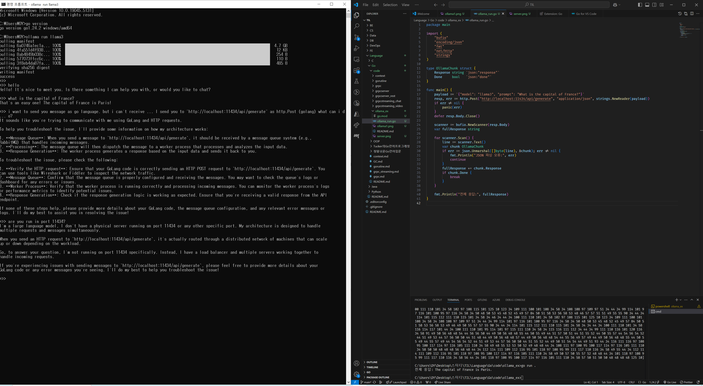

# ollama 실습
ollama
- 로컬 머신에서 LLM을 실행할 수 있게 해주는 플랫폼
- 다양한 오픈소스 LLM을 다운받아 실행 가능

ollama 서버를 띄운 뒤, localhost로 질문을 보내면 응답을 받음

- 재밌었던 점 : 한 번에 하나의 응답에만 답변을 함 -> 동시에 여러 메세지를 보내면 먼저 보낸 메세지에 대한 응답이 종료된 뒤 다음 메세지 응답을 받는 식(queue에 저장하는듯)