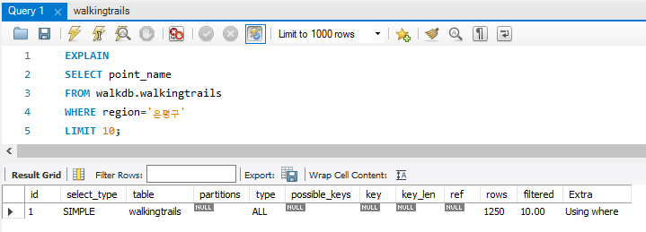

# Real MySQL - ch06 실행 계획
## 6.1 개요
`Explain` 이나 `desc` 로 확인 가능
- 옵티마이저 : DBMS의 쿼리 실행계획을 수립. 가장 복잡한 부분으로 알려져있음.

옵티마이저의 실행 계획을 알아내야만 실행 계획의 불합리한 부분을 알아내고 최적화 할 수 있음.
### 6.1.1 쿼리 실행 절차
1. 사용자로부터 요청된 SQL문을 잘개 쪼개서 MySQL 서버가 이해할 수 있게 분리
   - 이 단계를 "SQL 파싱(parsing)" 이라 함
   - SQL **신텍스 에러가** 여기에서 걸러짐
   - SQL 파스트리 생성됨(MySQL 서버는 SQL 자체가 아닌 SQL 파스트리로 쿼리 실행함)
2. SQL 파싱정보(파스트리)를 확인해 어떤 테이블부터 읽고 어떤 인덱스를 이용해 테이블을 읽을지 선택
   - 최적화 및 계획수립 단계
   - MySQL 서버 "옵티마이저"에서 처리
   - 실행계획 만든다.
   - SQL 파스트리로 아래 내용 처리
     - 불필요한 조건 제거, 복잡한 연산 단순화
     - 여러 테이블 조인 있는 경우 어떤 순서로 테이블 읽을지 결정
     - 각 테이블 조건과 인덱스 통계 정보 이용해 사용할 인덱스 결정
     - 가져온 레코드들을 임시 테이블에 넣고 다시 가공해야 하는지 결정
3. 결정된 테이블의 읽기 순서 or 선택된 인덱스를 이용해 스토리지 엔진으로부터 데이터 가져옴
    - 2단계에서 만든 실행계획대로 스토리지 엔진에 레코드를 읽어오도록 요청
    - MySQL 엔진에서 스토리지 엔진으로부터 받은 레코드 조인하거나 정렬하는 작업 수행

1, 2번 단계는 MySQL 엔진에서 처리, 3번단계는 MySQL 엔진과 스토리지 엔진이 동시에 참여해서 처리함


### 6.1.2 옵티마이저 종류
옵티마이저는 DB서버에서 두뇌 역할
- 비용 기반 최적화(Cost-based optimizer, CBO) : 현재 대부분의 DBMS가 선택
  - 쿼리 처리하기 위한 여러 가능한 방법 만들고,각 단위 작업 비용 정보와, 대상 테이블 통계정보로 각 실행계획 산출 -> 최소비용 처리방식 선택해 최종쿼리 실행
- 규칙 기반 최적화(Rule-based optimizer, RBO) : 예전 오라클에서 많이 사용
  - 옵티마이저 내장 우선순위에 따라 실행 계획 수립.
  - 통계 정보(테이블 레코드 건수, 컬럼값 분포도) 조사x -> 같은 쿼리에 대해 같은 실행방법 도출

이런게 있다 생각하는 정도. 실행 순서를 결정하는 부분. 옵티마이저의 우선순위가 무엇인지. 어떻게 실행할지.


### 6.1.3 통계 정보
- 통계정보가 명확해야 올바른 방향으로 쿼리 실행함
- MySQL에서의 통계정보는 대량의 레코드 건수와 인덱스의 유니크한 값의 개수 정도.
- 오라클과 같은 DBMS에서는 통계 정보 수집에 많은 시간 소요되어 통계 정보만 따로 백업함.
- MySQL 통계정보는 사용자가 알아채지 못하는 순간 변경되어 동적인 편. 
- 레코드 건수 많지 않으면 통계 정보 부정확한 경우 많아 `ANALYZE` 명령으로 통게 정보 갱신해야 함.

카탈로그 매니저?
- 테이블 마다 용량을 확인해야 하는 상황에 참조하는 상황에.
- information_schema
- index_stats : zmap schema 엄청 많은데 PK 변경한걸 다 확인 할 수 없으니까 MySQL 자체 통계 정보 보면서 PK 정보 확인 할 수 있음.


## 6.2 실행 계획 분석
`EXPLAIN` : 쿼리 실행 계획 확인 가능
- 확인하고 싶은 쿼리 문장 적으면 됨.
- UPDATE, DELETE, INSERT는 지원 안하니까 얘네 확인하고 싶으면 WHERE절만 SELECT에 떼서 확인해라

```SQL
EXPLAIN
SELECT point_name
FROM walkdb.walkingtrails
WHERE region='은평구'
LIMIT 10;
```

- 표 형태로 된 1줄 이상의 결과 표시됨
### 6.2.1 id 칼럼
**단위(SELECT) 쿼리** : SELECT 키워드 단위로 구분한 것
- !id 컬럼은 단위쿼리별로 값이 부과됨!
- ID가 같으면 같은 쿼리에 속해있다 판단해도 됨.

- 하나의 SELECT 문장 안에서 여러 테이블 조인하면, 조인하는 테이블 개수만큼 실행계획 레코드 출력되지만, 같은 id가 부여됨.
- SELECT 문장은 하나인데 여러 테이블 조인되는 경우는 id값증가하지 않고 같은 id 부여됨


### 6.2.2 select_type 칼럼
각 SELECT 쿼리가 어떤 타입의 쿼리인지 표시. 수행속도에 절대적인건 아님. 어떻게 실행되고 있냐~ 이정도만 확인하는거고 얘로 튜닝하지는 않음
- SIMPLE
  - UNION이나 서브쿼리 사용하지 않는 단순 SELECT인 경우
  - 실행계획에서 select_type이 SIMPLE인 경우는 반드시 하나만 존재함
- PRIMARY
  - UNION이나 서브쿼리 포함된 SELECT쿼리 실행계획에서 가장 바깥쪽(OUTER)에 있는 단위쿼리
  - 실행계획에서 select_type이 PRIMARY인 경우는 반드시 하나만 존재함
- UNION
  - UNION으로 결합하는 쿼리 중 첫번째를 제외한 **두번째 이후 단위**
  - 첫번째 단위는 UNION 쿼리로 결합된 전체 집합의 select_type이 표시됨
- DEPENDENT UNION
  - UNION이나 UNION ALL이 외부에 형향에 의해 영향을 받는 것.
  - UNION 쿼리 외부의 테이블 컬럼을 참조하는 등...
  - +) 하나의 단위(SELECT) 쿼리가 다른 단위 쿼리를 포함하고 있으면, 이를 서브쿼리라고 함. 서브쿼리가 사용된 경우 외부쿼리보다 서브쿼리가 먼저 실행됨. 다만 select_type DEPENDENT 키워드 포함하면 외부에 의존적이라 외부쿼리보다 서브쿼리가 먼저 실행될 수 없음. => DEPENDENT select_query는 비효율적인 경우가 많음
- UNION RESULT
  - UNION 결과 담아두는 테이블
  - 별도 ID값 부여 X(단위 쿼리 아니라서)
- SUBQUERY
  - FROM절 이외에서 사용되는 서브쿼리 -> 쿼리를 실행하는 동안 임시로 테이블을 생성해두는것이기 때문에(스토리지 엔진에 없음)
  - 서브쿼리는 사용되는 위치에 따라 다른 이름
    - NESTED QUERY : SELECT되는 컬럼에 사용된 서브쿼리
    - SUBQUERY : WHERE절에 사용된 경우
    - DERIVED : FROM절에 사용된 서브쿼리(MySQL에서는 파생테이블이라 함). Inline View 혹은 SubSelect
    - SCALAR SUBQUERY : 하나의 값만(컬럼 1개인 레코드 1개) 반환하는 쿼리
    - ROW SUBQUERY : 컬럼 개수 관계 없이 하나의 레코드 반환하는 쿼리
- DEPENDENT SUBQUERY
  - 서브쿼리가 바깥쪽 select 쿼리에서 정의된 컬럼을 사용하는 경우 -> 외부쿼리가 수행된 뒤 내부쿼리 수행되어야 하기 때문에 느린 경우 다수
- DERIVED
  - FROM절에 사용되는 서브쿼리
  - 단위SELECT 쿼리 실행결과를 메모리나 디스크에 임시테이블 생성함
  - 대부분 DERIVED 형태 실행계획을 조인으로 해결할 수 있도록 변경함
- UNCACHEABLE SUBQUERY
- UNCACHEABLE UNION
### 6.2.3 table 칼럼
MySQL 실행계획은 SELECT 쿼리 기준이 아닌 테이블 기준으로 표시됨. 테이블 별칭이 부과된 경우 별칭이 표시됨. 별도 테이블 사용하지않는 SELECT 쿼리의 경우 table NULL.

`<>` 로 둘러싸인 이름은 **임시테이블**. 표시되는 숫자는 단위SELECT쿼리의 id 지칭
### 6.2.4 type 칼럼
MySQL 각 테이블 레코드를 어떤 방식으로 읽었는지를 의미. -> 인덱스로 레코드를 읽었는지, 테이블을 처음부터 끝까지 읽는 풀 테이블 스캔으로 레코드를 읽었는지. **각 테이블 접근 방식(Access type)** -> 제일 중요함. 어떤 방식으로 테이블을 읽었는지. 어떤 인덱스를 참조하는지, 풀스캔 타는지. ALL이 테이블 전체 다 읽는거라 제일 느림
- system
  - 레코드가 1건 이하인 테이블을 참조하는 형태의 접근 방법
  - InnoDB 테이블에서는 나타나지 않고 MyISAM이나 MEMORY테이블에서만 나타남(InnoDB에서는 index로 표시될 가능성이 큼)
- const
  - 쿼리가 프라이머리키나 유니크 키 컬럼을 이용하는 WHERE 조건절 가지고 있으면서 반드시 1건 반환
  - PK 여러개면 여러 개 다 해야 함(3개면 3개 해야 CONST)
- eq_ref
  - 여러 테이블이 조인되는 쿼리의 실행계획에서만 표시됨
  - 조인에서 처음 읽은 테이블의 컬럼 값을, 그 다음에 읽어야 할 테이블에 프라이머리키나 유니크키 컬럼 검색조건에 사용하면 eq_ref
    - 첫번째 컬럼 값을 다음 테이블의 PK, UK에 사용
    - 순서만 바뀌는게 아니라 eq_ref 조건에 충족해야 하기 때문에
  - 조인에서 두번째 이후에 읽는 테이블에서 반드시 1건만 존재한다는 보장이 있어야 함
- ref
  - eq_ref와 다르게 조인 순서 관계없이 사용. 프라이머리나 유니크 키 제약조건도 없음
  - 동등조건으로만 비교됨
  - const, eq_ref가 아닌데 WHERE절에 동등비교연산자 들어가면 ref
- fulltext
  - MySQL 전문검색 인덱스로 레코드 읽는 접근방법
  - fulltext보다 명확이 빠른 const, eq_ref, ref접근방식 사용가능한 쿼리에서는 fulltext 선택 x.. 그러나 거의 매번 fulltext 사용
  - fulltext에서는 각 조건별 성능 확인해봐야 함
- ref_or_null
  - ref와 같은데 NULL 비교가 추가된 방식
- unique_subquery
  - WHERE조건절에서 사용될 수 있는 IN(subquery)형태의 쿼리를 위한 접근방식
  - 서브쿼리에서 중복되지 않은 유니크한 값만 반환될 때
- index_subquery => 이해가 잘 안됨..
  - subquery가 중복된 값 반환할 수 있지만, 중복된 값을 인덱스로 제거 가능할 때
- **range**
  - 인덱스 레인지 스캔 형태
    - <, >, IS NULL, BEWEEN, IN, LIKE
  - 빠르고 어느정도 성능 보장됨
  - 가장 많이 보게 됨
  - 데이터를 넣으면 PK가 따로 저장됨~! 그래서 PK값을 따로 저장함. PK로 색인하면 엄청 빠름. 테이블 용량도 PK도 많이 차지함.
  - 인덱스는 우리가 지정한거 : 값은 저장하지 않고. 우리가 지정한거. 규모는 작은데. 어느정도는 빠르다. -> 인덱스 값을 따로 저장하고 있어서 인덱스를 너무 많이 저장하면 테이블 용량이 엄청나게 커짐. 오히려 느려질 수 있음. 인덱싱을 잘 해놔야 함. 일반적으로 모든 테이블에 인덱스를 지정하지는 않는데, 검색을 자주 하는 테이블이나, 수정 날짜 기준으로 하는.. 기간으로 보여주는 데이터는 인덱스가 걸려있음(조회할 때 빠르니까).
    - 컬럼이 인덱스로 잡혀있으면, 인덱스로 검색할 수 있게 되고, RANGE로 검색됨. -> 인덱스 지정 안하면 ALL로 됨(개오래걸림) 
- index_merge
  - 2개 이상의 인덱스를 이용해 각 검색결과를 만든 후 그 결과를 병합하는 처리방식
  - 여러 인덱스를 읽어야 해서 range보다 효율 떨어짐
  - AND, OR 연산 복잡할딴 최적화 x..
  - 전문검색 인덱스 사용하면 index_merge 적용 x
- index
  - 인덱스를 처음부터 끝까지 읽는 인덱스 풀스캔
  - 플테이블스캔보다는 빠르지만 그닥 효육적이지는 않음
  - 아래 경우 주로 사용됨
    - range, const, ref 사용 불가
    - 인덱스에 포함된 커럼만으로 처리할 수 있는 쿼리
    - 인덱스를 이용해 정렬, 그룹핑 가능
  - 인덱스를 풀스캔한다. 인덱스만 풀스캔한다. 풀스캔이라 좋은건 아닌데.. -> 아무 조건 없이 ORDER BY 때린다던가;
- ALL
  - 풀테이블 스캔
  - 가장 비효율적인 스캔
  - ALL 뜨는건 잘못된 쿼리임.
  - 아무 인덱스도 안된걸 WHERE조건에 걸어버리면 7~800G를 그냥 다 읽는거라 거업나 오래걸림.. 좋지 않은 쿼리. => 인덱스를 적절하게 설정하는게 중요. 인덱스 컬럼이 자주 사용되는 컬럼, 데이터가 다양한 컬럼이여야 함. 멤버 번호(고유한 값)... 성별(남/여) 한정적이라 이걸 가지고...
    - 남/여 합쳐서도 나눠서도 검색해야 하는 테이블이면 굳이 정규화 하는것보다는(UNION 성능 구림) 그 앞에 먼저 조건을 걸어야 함 

### 6.2.5 possible_keys
"사용될 법 했던 인덱스 목록"
- 걍 무시하셈

### 6.2.6 key
최종 선택된 실행계획에서 사용되는 인덱스. type이 ALL일때와 같이 인덱스 전혀 사용 못하면 Key컬럼 NULL
- 내가 의도한값으로 잘 탔는지 확인하기
- KEY, INDEX 안잡았으면 걍 NULL

### 6.2.7 key_len
쿼리를 처리하기 위해 다중컬럼으로 만들어진 인덱스가 몇 개의 컬럼까지 사용했는지. 바이트값이 표시됨
- 잘 안봄

### 6.2.8 ref
참조 조건(Equal 비교조건)으로 어떤 값이 제공되었는지. 만약 산수값 지정했으면 ref 컬럼 값 const로 표시, 다른 테이블 컬럼값이면 해당 테이블명과 컬럼명 표시.
- func로 표시되는 경우 : 콜레이션 변환값이나 값 자체의 연산을 거쳐 참조되었다는 것을 의미함

### 6.2.9 rows
레코드 건수. 반환되는 레코드 건수가 아닌 쿼리를 처리하기 위해 얼마나 많은 레코드를 디스크로부터 읽고 체크해야 하는지 의미함. 오차 심함
- 작으면 작을수록 좋음.

### 6.2.10 Extra -> 여러 번 다시 보면서 질문 정리하기
쿼리 실행계획에서 성능에 관련된 중요한 내용이 Extra컬럼에 표시됨
- const row not found
  - const방식으로 읽었지만 실제로 해당 테이블에 레코드가 1건도 존재하지 않을 때
- Distinct
  - 조인하지 않아도 되는 항목은 무시하고 필요한것만 조회했으며, 필요한 레코드만 읽었다
- Full scan on NULL key
  - 컬림이 NULL이면 풀테이블스캔 해야만 결과 알아낼 수 있음(NOT NULL 컬럼이면 이 표시 무시해도 됨)
  - 서브쿼리가 1건이라도 결과레코드 가지면 최종비교 결과가 NULL, 1건도 가지지 않으면 FALSE
- Impossible HAVING
  - HAVING절을 만족하는 레코드 없을 때
- Impossible WHERE
  - WHRER 조건이 항상 FALSE인 경우
- Impossivle WHERE noticed after reading const tables
  - 
- No matching min/max row
  - 쿼리의 WHERE 조건절 만족하지 못하는 경우 중 `MIN()`,`MAX()` 결과가 한 건도 없는 경우 
- No matching row in const table
  - 조인테이블에서 const방식으로 접근할 때 일치하는 레코드가 없는 경우
- No tables used
  - FROM절에 상수테이블(CUAL)이 사용될 때
- Not exist
  - A테이블에 존재하지만 B테이블에 존재하지 않는 데이터 조회 시 NOT IN 이나 NOT EXIST 연산자를 사용하는데, 때에 따라 아우터 조인(LEFT OUTER JOIN)으로 구현 가능함. 이때 Not exist 메세지 표시됨
- Range checked for each record (index map: N)
  - 매 레코드마다 인덱스 레인지 스캔을 체크함(어떨땐 풀테이블스캔 사용, 어떨땐 레인지 스캔 사용)
- Scanned N databases
  - N개의 DB정보를 읽었는지 보여주는 것
    - 0 : 특정 테이블에 정보만 요청되어 DB 전체 메타정보 읽지 않음
    - 1 : 특정 DB 내 모든 스키마 정보 요청되어 해당 DB 모든 스키마 정보 읽음
    - All : MySQL 서버 내 모든 스키마 정보 다 읽음
- Select tables optimized away
  - `MIN()` `MAX()` 조회 쿼리가 적절한 인덱스를 사용할 수 없을 때 인덱스를 오름차순/내림차순 정렬해 1건만 읽는 형태의 최적화 적용됨
- Skip_open_table, Open frm_only, Open_trigger_only, Open_full_table
  - INFORMATIONS_SCHEMA DB의 메타정보 조회하는 SELECT 쿼리 실행계획에서만 표시되는 내용
  - Skip_open_table : 테이블 메타정보가 저장된 파일을 별도로 읽을 필요 없음
  - Open frm_only : 테이블 메타정보 저장된 파일(*.FRM)만 읽음
  - Open_trigger_only : 트리거 정보 저장된 파일(*.TRG)만 읽음
  - Open_full_table : 최적화 되지 못해 위 메타정보파일(*.FRM), 데이터( *.TRG), 인덱스 파일( *.MYI)까지 다 읽음
- unique row not found
  - 두 테이블이 각각 유니크/프라이머리 컬럼으로 아우터 조인 수행하는 쿼리에서, 아우터 테이블에 일치하는 레코드 없을 때
- Using filesort
  - ORDER BY 처리가 인덱스를 사용 못할 때
- Using index(커버링 인덱스)
  - 데이터 파일 전혀 읽지 않고 인덱스만 읽어서 쿼리 처리 가능할 때
  - 접근 방식이 eq_ref, ref, range, index_merge, index 등과 같이 인덱스 사용하는 실행계획에서는 모두 Using Index 표시 가능
- Using index for group-by
  - GROUP BY 연산 처리 위해 MySQL은 그룹핑 기준 칼럼으로 정렬 수행 -> 정렬된 결과 그룹핑하는 고부하작업 수행. 
  - GROUP BY 처리가 인덱스(B-TREE 한해) 이용하면 정렬된 인덱스 컬럼을 순서대로 읽으면서 그룹핑 처리.
    - 레코드 정렬 없이 인덱스만 읽으면 되기 때문에 효율적
- Using join buffer
  - 
- Using sort_union(...), Using union(...), Using intersect(...)
  - 쿼리가 index_merge 방식으로 실행되면, 2개 이상 인덱스가 동시 사용됨. -> EXTRA에서 두 인덱스 결과 어떻게 병합했는지 아래 3가지로 설명
  - Using intersect(...)
    - 각각의 인덱스를 사용할 수 있는 조건이 AND로 연결된경우, 각 처리 결과에서 교집합을 추출해내는 작업을 수행함
  - Using union(...)
    - 각각의 인덱스를 사용할 수 있는 조건이 OR로 연결된경우, 각 처리 결과에서 합집합을 추출해내는 작업을 수행함
  - Using sort_union(...)
    - Using union과 같은 작업을 수행하지만, Using union으로 처리 불가능한 경우(OR로 연결된 대량은 range 조건)
    - PK만 먼저 읽어 정렬, 병합 후 레코드를 읽어 반환
    - using union과 using sort_union은 정렬알고리즘의 싱글패스 정렬알고리즘/투패스 정렬알고리즘 차이와 같음
- Using temporary
  - MySQL 쿼리 처리하는 동안 중간 결과를 임시테이블에 저장.
  - Using temporary : 임시테이블 사용한다~(GROUP BY ... )
    - => 그 FROM 절 내 UNION연산같은 경우도 Using temporary 나오는지?
- Using where
  - MySQL은 내부적으로 크게 MySQL 엔진/스토리지 엔진 레이어로 나뉨.
  - MySQL엔진은 스토리지 엔진으로부터 받은 레코드를 가공or연산하는 작업을 수행
  - MySQL엔진레이어에서 별도의 가공 후 필터링 작업 처리 시 Using WHERE 코멘트 표시됨
- Using where with pushed condition

### 6.2.11 EXPLAIN EXTENDED(Filtered 컬럼)
필터링이 얼마나 효율적으로 실행됐는지 알려주기 위해 Filtered 컬럼 추가. 필터링되어 제거된 레코드 제외 최종적으로 레코드가 얼마나 남았는지 퍼센트(%)로 알려줌

### 6.2.12 EXPLAIN EXTENDED(추가 옵티마이저 정보)
분석된 파스트리 재조합하여 쿼리 문장과 비슷한 순서대로 나열해 보여주는것

### 6.2.13 EXPLAIN EXTENDED(Partitions 컬럼)
파티션 테이블 실행 계획 정보 확인. 쿼리를 사용하기 위해 테이블 파티션 중 어떤 파티션 사용했는지 정보 확인함.   
파티션 프루닝(Partition pruning) : 파티션 여러개인 테이블에서 불필요한 파티션 빼고 쿼리 수행하기 위해 접근해야 할 것으로 판단되는 테이블만 골라내는 과정
- `EXPLAIN PARTITIONS` 명령으로 참조한 파티션 확인 간으


## 6.3 MySQL의 주요 처리 방식


## 6.4 실행 계획 분석 시 주의사항


## 읽기 좋은 블로그
- [데이터베이스 옵티마이저에 대하여](https://coding-factory.tistory.com/743)
- [Optimize Table & Analyze Table](https://myinfrabox.tistory.com/145)
- [InnoDB에 대하여(MyISAM과 차이점)](https://sarc.io/index.php/mariadb/346-innodb-myisam)

## QnA
### Q) 옵티마이저를 일종의 컴파일러로 이해해도 되는 것인지

### Q) select_type 컬럼에서 SIMPLE은 왜 하나만 존재함?

### Q) 첫번째 단위는 UNION 쿼리로 결합된 전체 집합의 select_type이 표시됨 -> ?

### Q) 튜닝 시 실제로 실행계획을 참고하는 편인지

### Q) ref는 where절에 동등조건 비교만 있으면 되는건지

### Q) 아래 경우 e.emp_no가 프라이머리나 유니크 키값이 아닐 때, employees가 depth_emp보다 먼저 조인되었으므로 eq_ref라고 판단 불가능 한 것인지
```sql
EXPLAIN
SELECT * FROM employees e, dept_emp de
WHERE e.emp_no=de.emp_no AND de.dept.no='d005'
```
