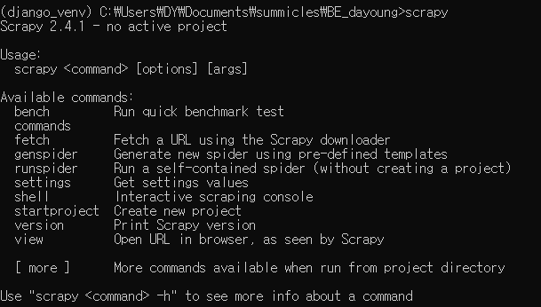
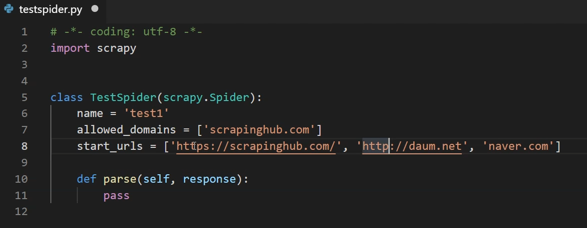

# Scrapy 기초
## Scrapy 설치(윈도우)
`pip install scrapy`   
- 오류 시 visualstudio 설치    

셋업 툴 업그레이드   
`pip install --upgrade setuptools`    
    
pip upgrade   
`python -m pip install --upgrade pip`
    
Win32 에러 발생 시(윈도우10)   
`pip install pypiwin32`     
    
cmd창에 scrapy 명령을 쳤을 때 다음과 같은 화면이 나오면 설치 성공   

## Scrapy 프레임워크
### 장점
- 이미 만들어진 **프레임워크** 이기 때문에 사용 편리
  - 검증된 프레임워크.
- 특정 사이트의 이미지만 추출, 매일 뉴스 기사의 특정 카테고리만 추출 할 때 유리
- 빠르고 안정적
- 가장 많은 레퍼런스를 얻을 수 있는 프레임워크.
- 사용자가 많기 때문에 빠른 응대 가능
- 넓은 범위의 자료를 가져올 수 있음
- 성능 좋음
- 다양한 포멧으로 저장 가능.
- 서버에 부하를 주지 않는 다양한 옵션
- DB에 쉽게 저장 가능(pipeline 기능)

### 구조

- spiders가 직접 크롤링을 해 오는 역할. 핵심

#### 프로젝트 생성
`scrapy startproject 프로젝트명`
#### Spider 생성
크롤링의 핵심. Spider를 만들어줘야 정확히 크롤링 가능    
- cfg파일이 있는 곳으로 가서 명령을 해 줘야함!

`scrapy genspider 스파이더명 크롤링할사이트`     
그러면 스파이더에 이런 파일 생성됨     

- start_urls에 여러 사이트 추가해서 병렬처리도 가능. Scrapy의 장점.
  - allowed_domain에도 방문할 사이트 추가해야 함.

### 실행
#### Runspider
core가 있는 위치(testspider.py)에 가서    
`scrapy runspider testspider.py`
- 만드는 중간 테스트 할 때
- python파일 독립적 실행
#### Crawl
`scrapy crawl spider_name`
- 위 프로젝트에서는 test1
- 완성직후 실행.
  - 아침 9시마다 크롤링 할 때 crawl명령어 설정해서 크롤링

#### --nolog
실행할 때 끝에 `--nolog` 붙이면 로그 뜨지 않음.